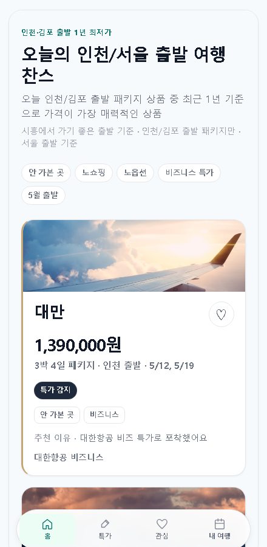
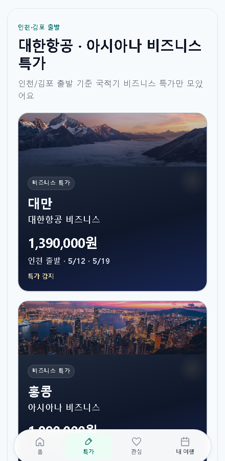
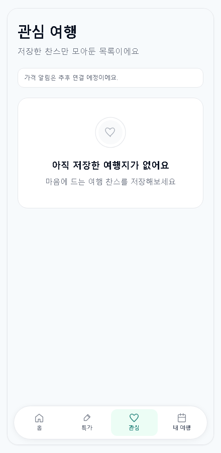
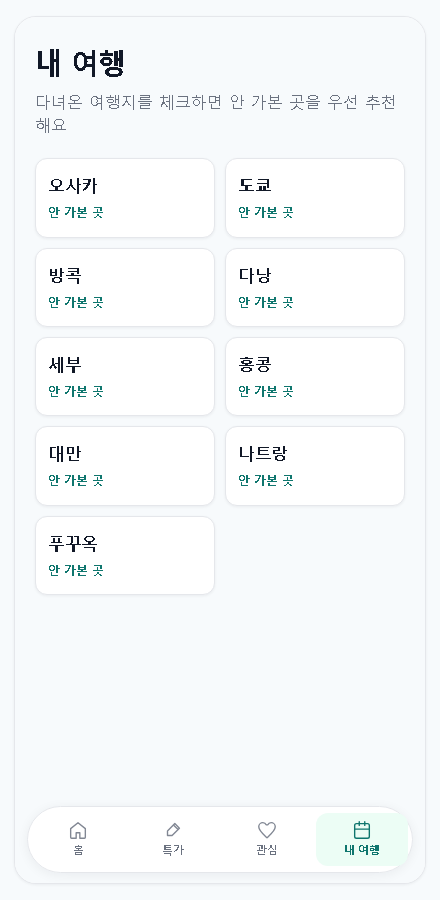

# UI 미리보기 (스크린샷)

총사령관·검토자가 **문서와 이미지만으로** 현재 MVP 화면을 빠르게 파악할 수 있도록 정리했습니다.  
캡처는 모바일 폭(약 440px) 기준이며, 실제 앱은 하단 탭으로 동일한 화면을 전환합니다.

---

## 1. 홈 — 오늘의 여행 찬스

**역할:** **인천·김포 출발** 패키지 찬스 카드(샘플 5개), 상단 필터 칩, 커버 이미지·가격·**출발 공항+일정**·관심 저장. (전국/지방 출발 미포함)

---

## 2. 특가 — 비즈니스

**역할:** **인천/김포 출발** 대한항공·아시아나 비즈니스 특가 카드. 딥 네이비 톤·상단 이미지·가격·출발 공항+일정·특가 감지.

---

## 3. 관심

**역할:** 관심 저장한 여행 상품 목록(홈과 동일 카드 UI). 저장이 없을 때는 안내 문구·아이콘. 가격 알림은 추후 안내 문구만.

---

## 4. 내 여행

**역할:** 다녀온 도시 체크(2열 칩). 체크 내용은 홈 추천·「안 가본 곳」 판단에 반영. (이 화면에는 이미지 없음)

---

## 파일 경로

| 파일 | 설명 |
|------|------|
| `docs/screenshots/home.png` | 홈 |
| `docs/screenshots/business.png` | 특가 |
| `docs/screenshots/favorites.png` | 관심 |
| `docs/screenshots/my-trips.png` | 내 여행 |

로컬에서 이미지가 보이지 않으면 저장소 루트의 `docs/screenshots/` 폴더를 확인하세요.
